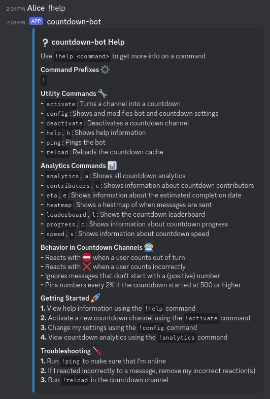
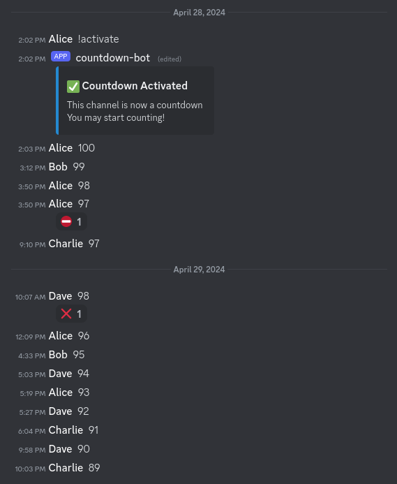
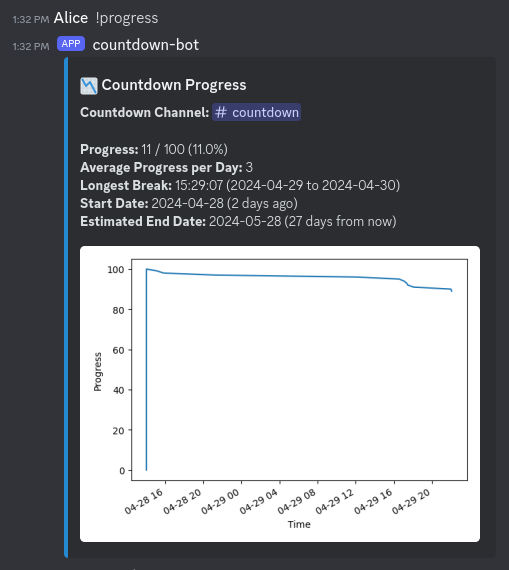
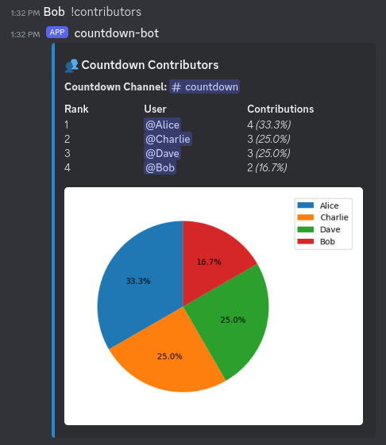
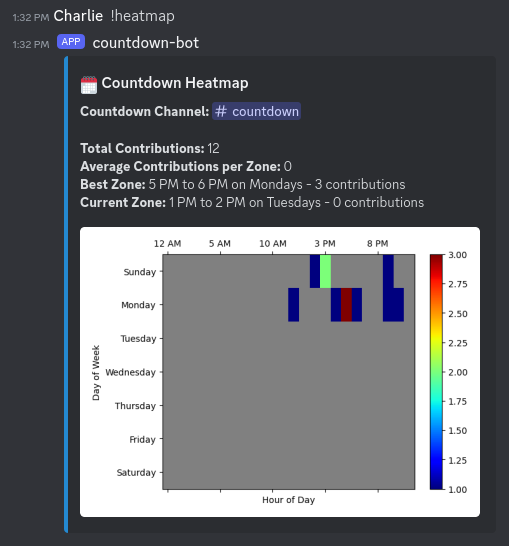
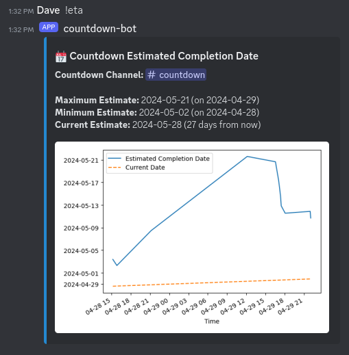

# countdown-bot
A Discord bot that facilitates countdowns and generates detailed countdown
analytics

## Setup
1. Go to the [Discord Developer Portal](https://discord.com/developers/) and
   create an application and a bot

2. Setup a database and run the bot (see below)

3. Add the bot to your server:
   `https://discordapp.com/oauth2/authorize?client_id=BOT_ID_HERE&scope=bot&permissions=101440`

4. Send `!help` to the bot to get instructions for getting started

### Running with Docker
Create an `.env` file and add the following variables:

```
BOT_TOKEN=...
DB_PASSWORD=...
```

Start the docker containers:

```
docker compose up
```

### Running for development
Install the Python dependencies

```
pip install -r requirements.txt
```

Create an `.env` file and add the following variables:

```
BOT_TOKEN=...
PREFIX=!
DATABASE=postgresql://...
LOG_FILE=log.txt
LOG_LEVEL=INFO
```

Setup a PostgreSQL database and initialize it:

```
psql 'postgresql://...' -f models/ddl.sql -f models/dml-utils.sql \
    -f models/dml-core.sql -f models/dml-analytics.sql
```

Run the bot

```
python -m countdown_bot
```

## Screenshots











